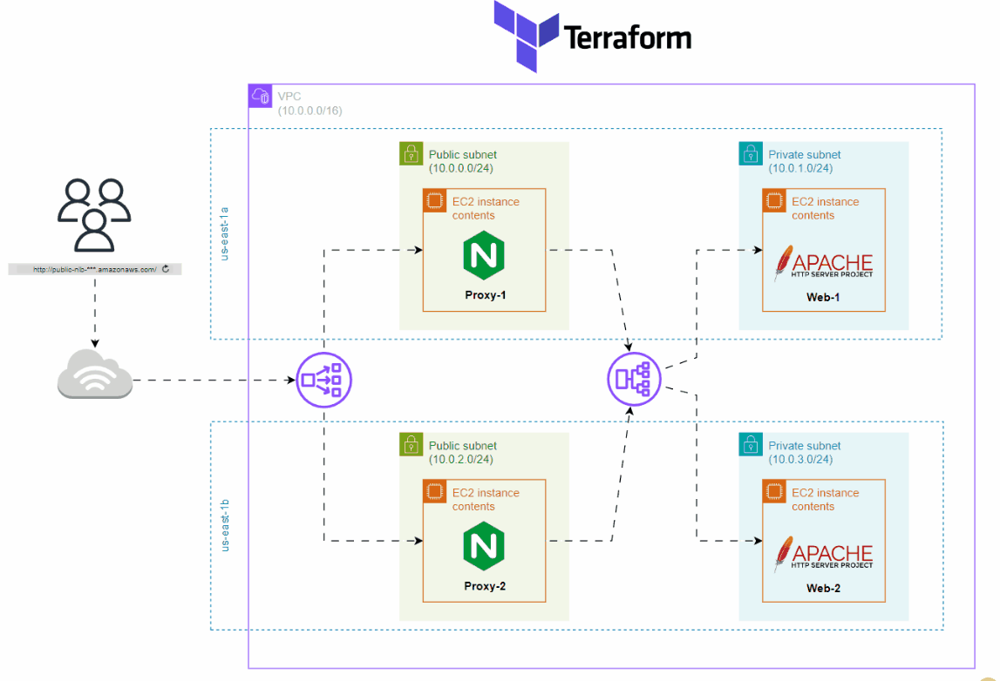

# Final Project Terraform 

# Project Description
This Terraform configuration builds a resilient web application infrastructure on AWS. It deploys EC2 instances across different availability zones to ensure high availability. A Network Load Balancer (NLB) is placed in front of NGINX proxy servers within the public subnets to handle and balance incoming traffic. Behind the proxies, an Application Load Balancer (ALB) distributes requests to Apache web servers running in private subnets, ensuring efficient traffic routing and isolation.

##  Project Files

- [Download Project Details](https://github.com/SamWL/ITI-Terraform-Project/blob/master/Terraform%20Project%20sam.pdf)

